# Lutherie_3D

## List :

| Name | Category | Tested and Working | Instructions |
| --- | --- | --- | --- |
| Alto Trombone | Wind | Yes |  | 
| Baglama | String | Yes |  | 
| Book Of Boba Fett Catina Fretless Guitar| String | | | 
| Book Of Boba Fett Catina Guitar | String | |  | 
| Double Neck Ukulele Madoline | String | |  | 
| Duduk | Wind | Yes |  | 
| Duduk Ariane 5 | Wind | Yes |  | 
| Duduk In F | Wind | Yes |  | 
| Electric semi acoustic nylon mandoline | String | | Yes | 
| Flying Microtonal Guitalele | String | Yes |  | 
| Fred The Eurorack Module | Other | Yes |  | 
| Fretless Gurdy | String | |  | 
| Guqin | String | |  | 
| Kitty Bone | Wind | Yes |  | 
| Kokyu | String | Yes |  | 
| Multi Intrument | other | |  | 
| Oud | String | Yes |  | 
| Pan Flute | Wind | Yes |   | 
| Saz | String | Yes |  | 
| Sazando | String | Yes |  | 
| Serpent | Wind | Yes |  | 
| Shakuachi | Wind | Yes |  | 
| Squarebone | Wind | Yes |  | 
| Tagelharpa Mini | String | Yes |  | 
| Trisax | Wind | Yes |  | 
| Zurna_Duduk | Wind | Yes |  | 

## String Instruments

### Baglama
This is a greek traditional instrument
To assemble it you need a 6mm steel rod

### Book Of Boba Fett Catina Fretless Guitar

  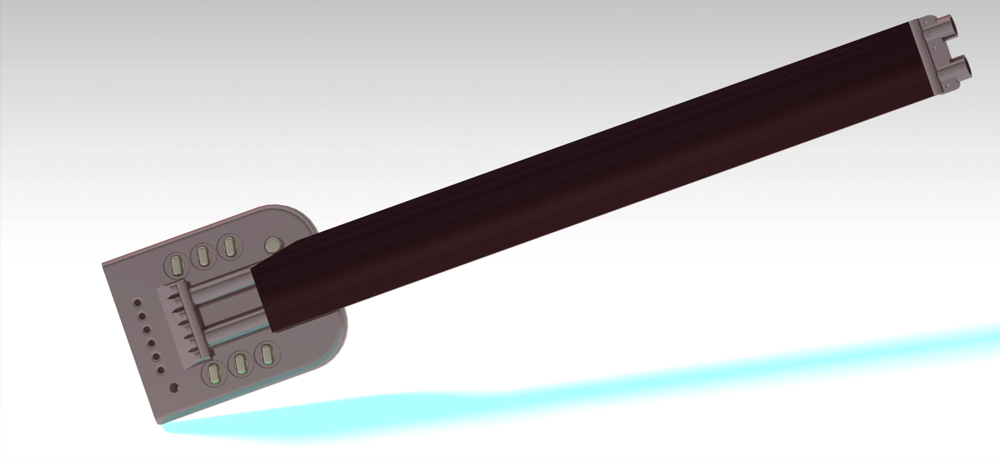

### Book Of Boba Fett Catina Guitar

  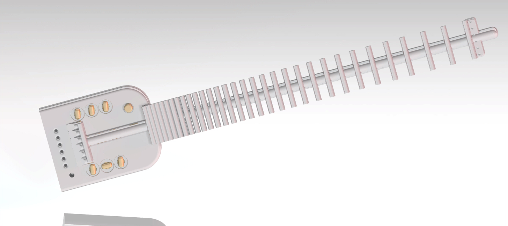

### Double Neck Ukulele Madoline 

  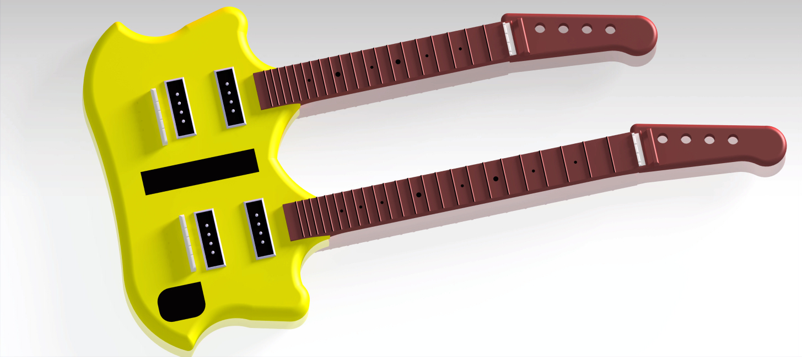

  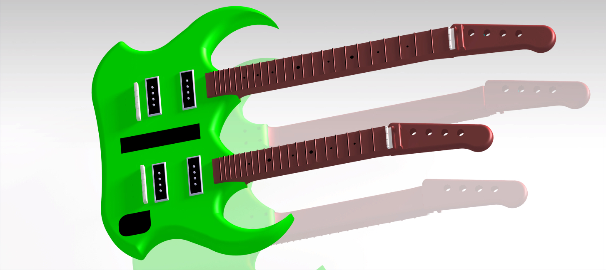

### Electric semi acoustic nylon mandoline

  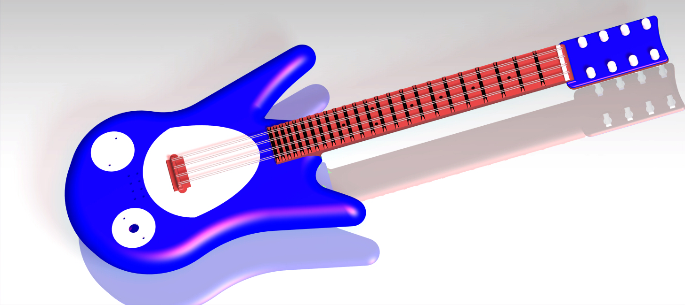

### Flying Microtonal Guitalele
This is a Flying Microtonal Guitalele inspired by King Gizzard and the Lizard Wizard 
You need a 6 mm metal rod to assemble it

### Fretless Gurdy

  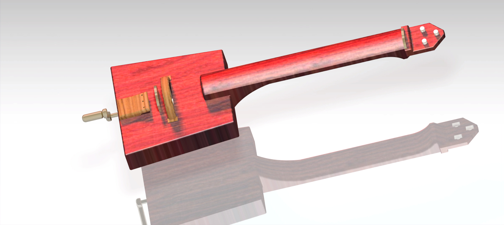

A fretless hudy gurdy like a violia but with a wheel
you need three metal rod to assemble it : 8mm x 500mm, 8mm x 110mm and 6mm x 380mm

### Guqin

  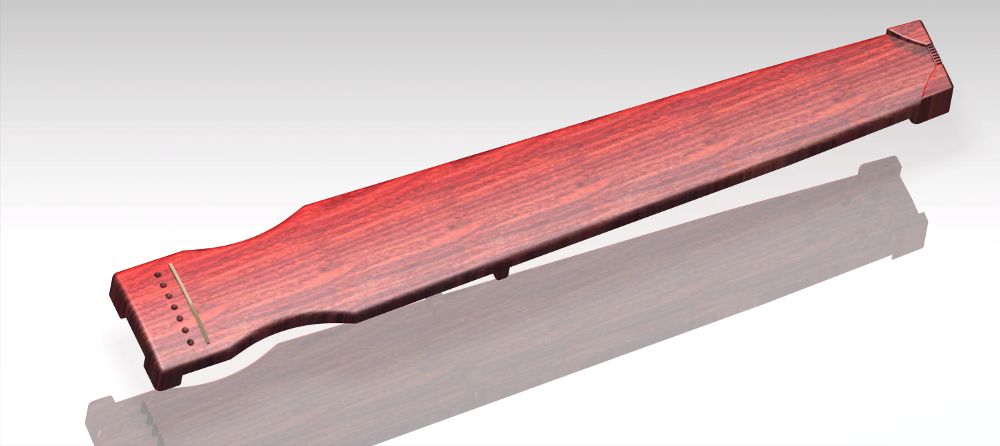

This is a traditional chinese instrument with seven strings

### Kokyu

  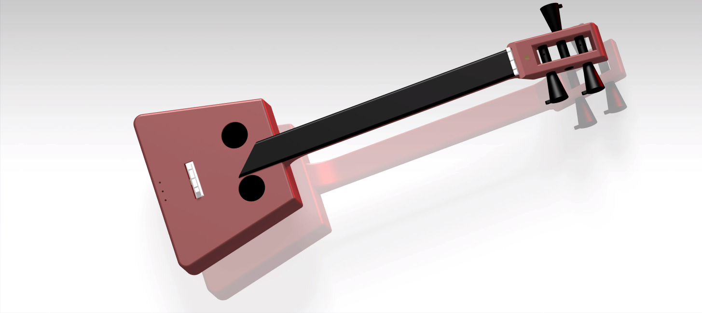

This is a traditional japanese bowed string instrument

### Oud
This is an oud this a short-neck lute-type, pear-shaped, fretless stringed instrument.
There is a thin one (easier to print less plastic and the one i printed) and a fat one (bigger and more close to a traditional one).
You will need two 2 mm metal rod and a 6mm one for assembly with 6 guitar tuning peg.

### Saz
This is a long neck luth
You need a 8 mm metal rod to assemble it
I put the 3 Low strings of a nylon guitar. Tuned in D A d

### Sazando
This is a sasando, a tube zither from the Rote island (indonesia)

### Tagelharpa
A mini tagelharpa i designed in catia, this is a bowed lyre
You need two 6mm metal rod to assemble it

## Wind Instruments

 ### Alto Trombone

  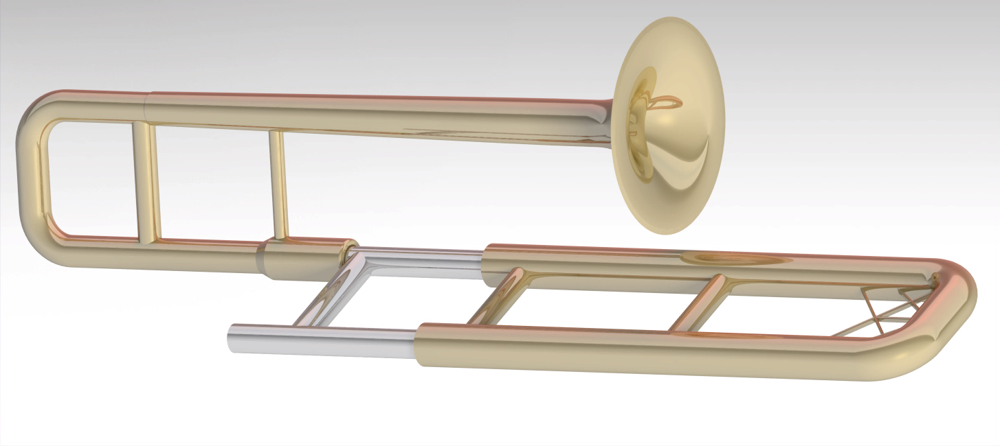

An alto trombone to print
You can print it in 3 parts if your printer is big enough.
Otherwise the main 3 parts can be printeted and assembled individualy, you need to print every parts 1 time except the innerslide an outerslide connector that should be printed 4 times each.

### Duduk
This is a duduk in C, it works with any duduk reeds.
If you print it in 2 part you have to glue the two parts to reduce any air leaks.

### Duduk Ariane 5
This is a duduk in C that is shaped like a rocket (ariane 5).

### Duduk In F
This is a duduk in F
The fingering is not similar to a traditional duduk

### KittyBone

  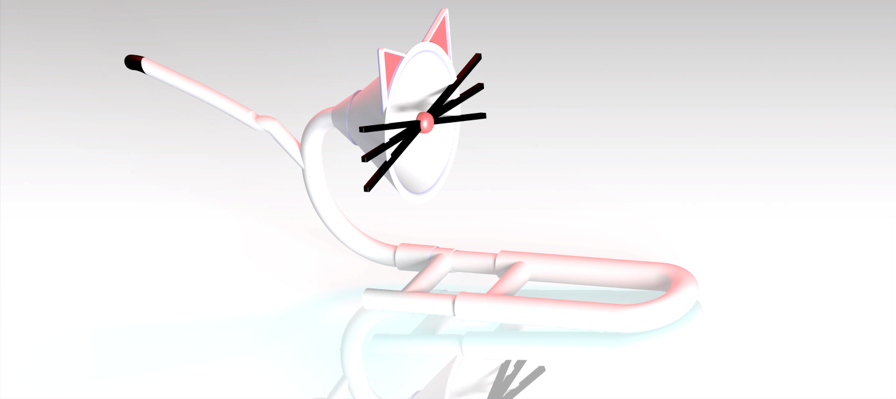

This is a picollo trombone but better because Cats
the tail is optional as it get in your face
you will need to glue the bell part 1, the bell part 2 and the nose and whiskers in order to assembeled them
the UWU mouthpiece icluded works but you will get a better sound with a trumpet or trombone mouthpiece.

### Pan Flute

  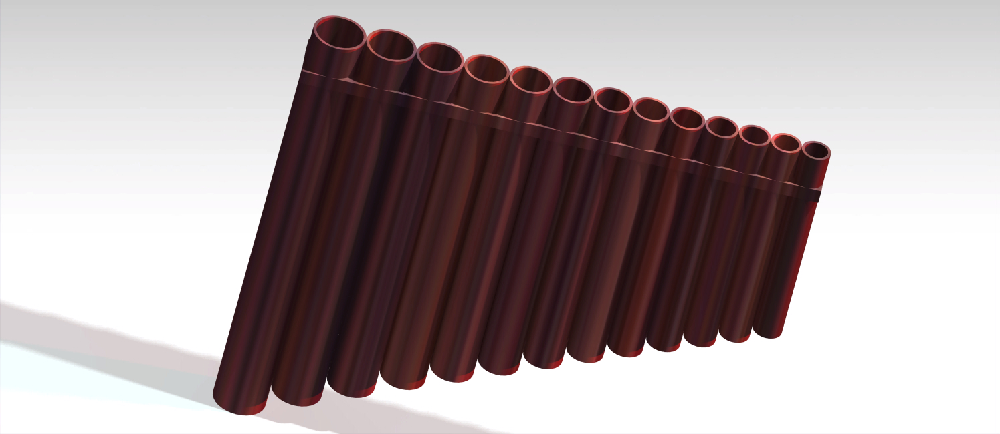

This is a pan flute in C

### Serpent
This is a straight version of a bass serpent however in soprano size.
The model had been cut to be printed in smaller part.
Tt shoud work with any standart trombone mouthpiece.

### Shamizen 
This is a japanese traditional instrument

### SquareBone
This is a picolo trombone with a squares, it is dimentioned to work with any standartd mouthpiece

### Trisax
This is a mini saxophone in B.

###Zurna Duduk
This is a zurna type intrument in E that you use with a duduk mouthpiece

## Other

### Multi Intrument

  

